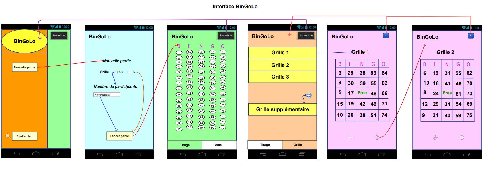

# **Projet perso : "BinGoLo" Hammer Julien**
_________________________________________________________________________________________________________________

Ce dépot contient une mini-application pour le Projet BinGoLo. 

## Introduction

L'application BinGoLo se base sur le jeu Bingo. L'idée principal est de permettre a ses amis, sa famille de jouer simplement avec une feuille et un crayon. Elle permet un tirage automatique avec 5 colonnes (B, I, N, G, O et les chiffres de 1 à 75 inclus). Il est possible si l'utilisateur le souhaite, la créations de grilles en fonction du nombre de joueur. Il pourra également rajouter des grilles à tout moment.

_________________________________________________________________________________________________________________

## Fonctionnalité 

- Visualisation du tirage avec les chiffres déjà sorties et non sorties.

- Démarrage, mise en pause, reprise, et suppression du compteur.

- Visualisation des grilles (possibilité d’ajout et de suppression de grille)

_________________________________________________________________________________________________________________

## Stockage des grilles et du tirage

Stockage des grilles et chiffres du tirage : Utilisation de SQLight Room (Sockage local)

_________________________________________________________________________________________________________________

## Mock-up de l'interface



_________________________________________________________________________________________________________________












